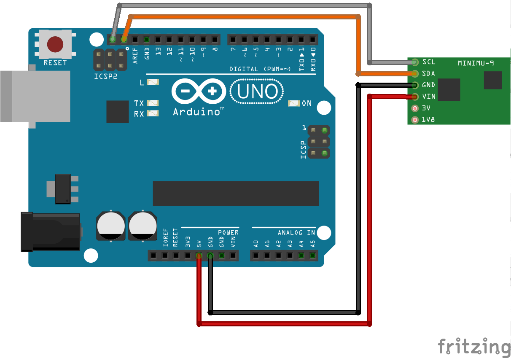

<!--remove-start-->

# IMU - MINIMU9 v3

<!--remove-end-->


##### Breadboard for "IMU - MINIMU9 v3"


<br>

Fritzing diagram: [docs/breadboard/MINIMU-9.fzz](breadboard/MINIMU-9.fzz)

The MINIMU9V3 driver supports the [MinIMU-9 v3](https://www.pololu.com/product/2468) and [AltIMU-10 v4](https://www.pololu.com/product/2470) carriers from Pololu that combine a LSM303D accelerometer/magnetometer board and a L3GD20H gyro (The barometer on the AltIMU is not supported). 

The same sensors are also used on boards from Adafruit the [9 DOF IMU](https://www.adafruit.com/product/1714) and [10 DOF IMU](https://www.adafruit.com/product/1604).

The individual senors are also available on various breakout boards and these drivers are also available to use independantly.


Run this example from the command line with:
```bash
node eg/imu-minimu9.js
```


```javascript
var five = require("johnny-five"),
  board;

board = new five.Board();

board.on("ready", function () {


  var imu = new five.IMU({
    controller: "MINIMU9V3",
	addressLSM303D: 0x1D, //optional
	addressL3GD20H: 0x6B  //optional
  });


  imu.on("change", function () {

    console.log("accelerometer");
    console.log("  x            : ", this.accelerometer.x);
    console.log("  y            : ", this.accelerometer.y);
    console.log("  z            : ", this.accelerometer.z);
    console.log("  pitch        : ", this.accelerometer.pitch);
    console.log("  roll         : ", this.accelerometer.roll);
    console.log("  acceleration : ", this.accelerometer.acceleration);
    console.log("  inclination  : ", this.accelerometer.inclination);
    console.log("  orientation  : ", this.accelerometer.orientation);
    console.log("--------------------------------------");
    
    console.log("gyro");
    console.log("  x            : ", this.gyro.x);
    console.log("  y            : ", this.gyro.y);
    console.log("  z            : ", this.gyro.z);
    console.log("  pitch        : ", this.gyro.pitch);
    console.log("  roll         : ", this.gyro.roll);
    console.log("  yaw          : ", this.gyro.yaw);
    console.log("  rate         : ", this.gyro.rate);
    console.log("  isCalibrated : ", this.gyro.isCalibrated);
    console.log("--------------------------------------"); 

  });
});

```


&nbsp;

<!--remove-start-->

## License
Copyright (c) 2012, 2013, 2014 Rick Waldron <waldron.rick@gmail.com>
Licensed under the MIT license.
Copyright (c) 2016 The Johnny-Five Contributors
Licensed under the MIT license.

<!--remove-end-->
